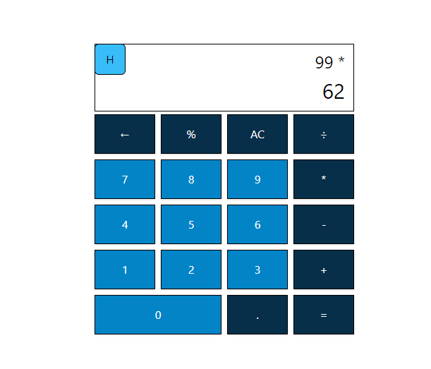
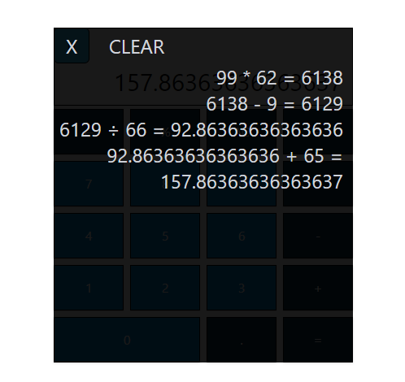

# Calculator

A simple calculator web application built with React, TypeScript, Vite, and TailwindCSS. This project intentionally avoids using the built-in `eval()` function in JavaScript to provide me the challenge and a more controlled approach to expression evaluation.

Check out the live site [here](https://alfredpaguio.github.io/react-ts-calculator/).

## Technologies Used

- [**React**](https://react.dev/): A JavaScript library for web and native user interfaces. Build user interfaces out of individual pieces called components written in JavaScript.
- [**TypeScript**](https://www.typescriptlang.org/): A strongly typed programming language that builds on JavaScript, giving you better tooling at any scale.
- [**Vite**](https://vitejs.dev/): A fast, opinionated frontend build tool that aims to provide a faster and leaner development experience for modern web projects.
- [**TailwindCSS**](https://tailwindcss.com/): A utility-first CSS framework for rapidly building modern websites without ever leaving your HTML.
- [**Jest**](https://jestjs.io/): A delightful JavaScript testing framework with a focus on simplicity.

## Getting Started

To run this project locally, follow these steps:

1. Clone the repository:
   ```sh
   git clone https://github.com/AlfredPaguio/react-ts-calculator.git
   ```
2. Install dependencies:
   ```sh
   npm install
   ```
3. Start the development server:
   ```sh
   npm run dev
   ```
   **Note:**
   You can test the application by running:
   ```sh
   npm test
   ```

## Screenshots




## Live Demo

Check out the live demo [here](https://alfredpaguio.github.io/react-ts-calculator/).

## Contributions

I welcome contributions and feedback. If you'd like to contribute or send feedback, please contact me.
